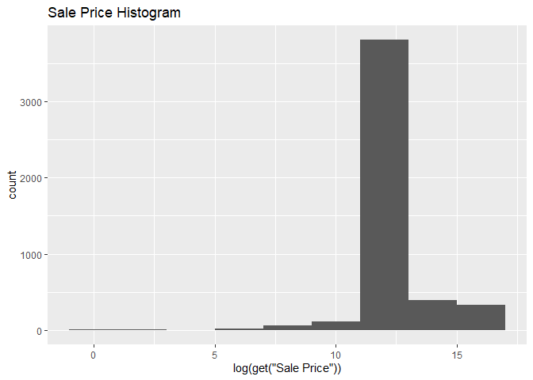
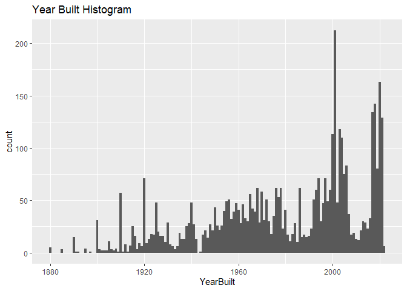
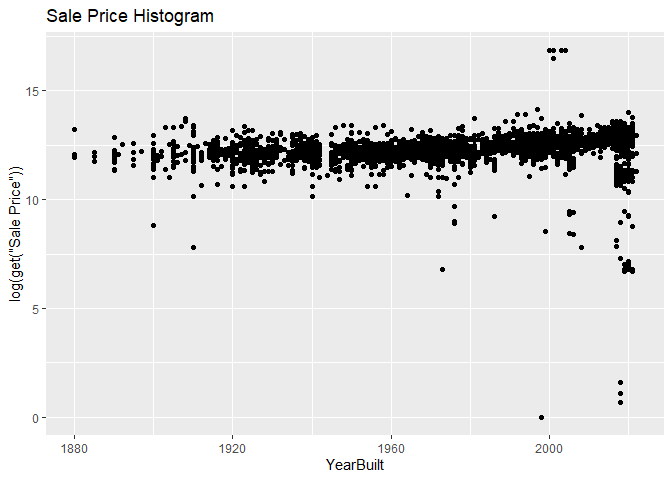

<!-- README.md is generated from README.Rmd. Please edit the README.Rmd file -->

# Lab report \#1

Follow the instructions posted at
<https://ds202-at-isu.github.io/labs.html> for the lab assignment. The
work is meant to be finished during the lab time, but you have time
until Monday evening to polish things.

Include your answers in this document (Rmd file). Make sure that it
knits properly (into the md file). Upload both the Rmd and the md file
to your repository.

All submissions to the github repo will be automatically uploaded for
grading once the due date is passed. Submit a link to your repository on
Canvas (only one submission per team) to signal to the instructors that
you are done with your submission.

``` r
library(classdata)
head(ames)
```

    ##    Parcel ID                       Address             Style
    ## 1 0903202160      1024 RIDGEWOOD AVE, AMES 1 1/2 Story Frame
    ## 2 0907428215 4503 TWAIN CIR UNIT 105, AMES     1 Story Frame
    ## 3 0909428070        2030 MCCARTHY RD, AMES     1 Story Frame
    ## 4 0923203160         3404 EMERALD DR, AMES     1 Story Frame
    ## 5 0520440010       4507 EVEREST  AVE, AMES              <NA>
    ## 6 0907275030       4512 HEMINGWAY DR, AMES     2 Story Frame
    ##                        Occupancy  Sale Date Sale Price Multi Sale YearBuilt
    ## 1 Single-Family / Owner Occupied 2022-08-12     181900       <NA>      1940
    ## 2                    Condominium 2022-08-04     127100       <NA>      2006
    ## 3 Single-Family / Owner Occupied 2022-08-15          0       <NA>      1951
    ## 4                      Townhouse 2022-08-09     245000       <NA>      1997
    ## 5                           <NA> 2022-08-03     449664       <NA>        NA
    ## 6 Single-Family / Owner Occupied 2022-08-16     368000       <NA>      1996
    ##   Acres TotalLivingArea (sf) Bedrooms FinishedBsmtArea (sf) LotArea(sf)  AC
    ## 1 0.109                 1030        2                    NA        4740 Yes
    ## 2 0.027                  771        1                    NA        1181 Yes
    ## 3 0.321                 1456        3                  1261       14000 Yes
    ## 4 0.103                 1289        4                   890        4500 Yes
    ## 5 0.287                   NA       NA                    NA       12493  No
    ## 6 0.494                 2223        4                    NA       21533 Yes
    ##   FirePlace              Neighborhood
    ## 1       Yes       (28) Res: Brookside
    ## 2        No    (55) Res: Dakota Ridge
    ## 3        No        (32) Res: Crawford
    ## 4        No        (31) Res: Mitchell
    ## 5        No (19) Res: North Ridge Hei
    ## 6       Yes   (37) Res: College Creek

The ames data set contains the following variables followed by what we
expect the range of each to be:

- parcel id
- Address
- Style
- Occupancy
- Sale Date (1900-2025)
- Sale Price (0-2.5M)
- Multi Sale
- Year Built (1900-2025)
- Acres (0-5)
- Square Feet (0-10,000)
- Bedrooms (0-5)
- Finished Basement SF (0-700)
- Lot Area SF (0-100,000)
- AC (Yes/No)
- Fireplace (Yes/No)
- Neighborhood

2.  The variable of special interest or focus is Sale Price.

3.  Range of the variable, histogram, and general pattern.

``` r
range(ames$`Sale Price`, na.rm = TRUE)
```

    ## [1]        0 20500000

``` r
library(ggplot2)
```

    ## Warning: package 'ggplot2' was built under R version 4.4.2

``` r
ggplot(ames, aes(x = log(get("Sale Price")))) + 
  geom_histogram(binwidth=2) +
  ggtitle("Sale Price Histogram")
```

    ## Warning: Removed 2206 rows containing non-finite outside the scale range
    ## (`stat_bin()`).

<!-- -->

Devon’s Work:

``` r
range(ames$YearBuilt, na.rm = TRUE)
```

    ## [1]    0 2022

``` r
library(dplyr)
```

    ## 
    ## Attaching package: 'dplyr'

    ## The following objects are masked from 'package:stats':
    ## 
    ##     filter, lag

    ## The following objects are masked from 'package:base':
    ## 
    ##     intersect, setdiff, setequal, union

``` r
library(ggplot2)
year <- filter(ames, YearBuilt != 0 & get("Sale Price")!=0)
ggplot(year, aes(x = YearBuilt)) + 
  geom_histogram(binwidth = 1) +
  ggtitle("Year Built Histogram")
```

<!-- -->

After removing an outlier with the value 0, the distribution of Year
built seems to increase as the years become more current. There are
various peaks and valleys.

``` r
library(dplyr)
library(ggplot2)
ggplot(year, aes(y = log(get("Sale Price")), x = YearBuilt)) + 
  geom_point() +
  ggtitle("Sale Price Histogram")
```

<!-- -->

There does not appear to be a relationship between YearBuilt and Sale
Price. The sale prices of homes seems to be relatively constant across
years that homes were built.However, this graph shows that some of the
lowest sale prices were houses built around the time of the 2008 housing
crisis.
